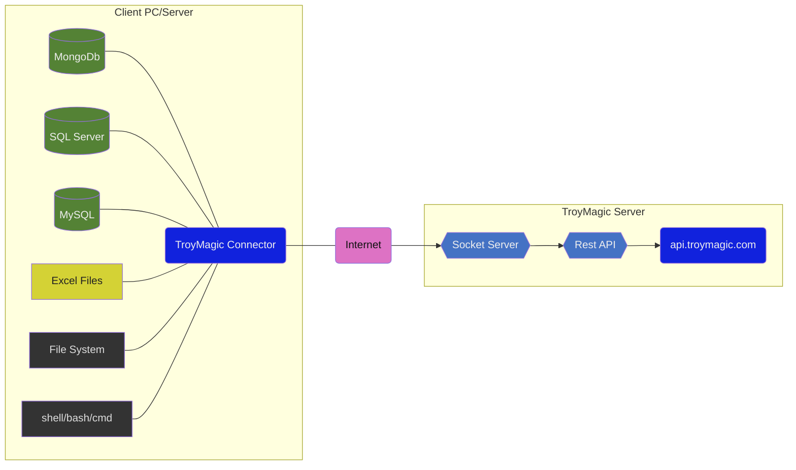

# TroyMagic 

Remote connector service. Troy Magic provides you processing data from your server or computer via Rest service.

- [Structure](#structure)
- [TroyMagic Client Connector](#troymagic-client-connector)
	- [Supported Data Systems](#supported-data-systems)
	- [Download & Install](#download--install)
	- [ID & Password](#id--password)
- [REST API](#rest-api)
  - [Rest API Base Url Path](#access-point-url)
  - [Authentication](#authentication)


# TroyMagic Client Connector
Download & install this connector to reach to your pc/server over TroyMagic Rest Services.

## Supported Data Systems
- SQL Server
- MySQL
- PostgreSQL
- MongoDB
- Excel
- File System
- Linux Shell
- Windows Command Prompt

## Download & Install
Download [TroyMagic (for Windows)](https://github.com/shamancoders/troymagic/blob/main/dist/troymagic.zip) client connector application.
Unpack zip file and run `troymagic_setup.exe`
Setup needs administration privileges to install properly.

## ID & Password
When the connector runs first time, it takes new id and password from TroyMagic Server. You need them for authentication.


# REST API

## Access Point Url

  https://troymagic.com/api/v1/[func]


## Authentication
- Http Header	: `[ "token":"<TOKEN>"]`
- Query string	: `/api/v1/:func?token=<TOKEN>`
- Http Body	: `{"token":"<TOKEN>"}`

## Response Samples

> Successful Response

    HTTP/1.1 200 OK
    Status: 200
    Content-Type: application/json

```json
{
    "success": true,
    "data": {
        "time": 1650232053838,
        "server": "2022-04-18 00:47:33",
        "utc": "2022-04-17 21:47:33",
        "timeOffset": 180
    }
}
```

> Error Response

    HTTP/1.1 403 Forbidden
    Status: 403
    Content-Type: application/json

```json
{
    "success": false,
    "error": {
        "code": "NO_TOKEN_PROVIDED",
        "message": "No token provided"
    }
}
```

> Function Not Found Response

    HTTP/1.1 404 Not Found
    Status: 404
    Content-Type: application/json

```json
{
    "success": false,
    "error": {
        "code": "404",
        "message": "function not found"
    }
}
```


## Structure


